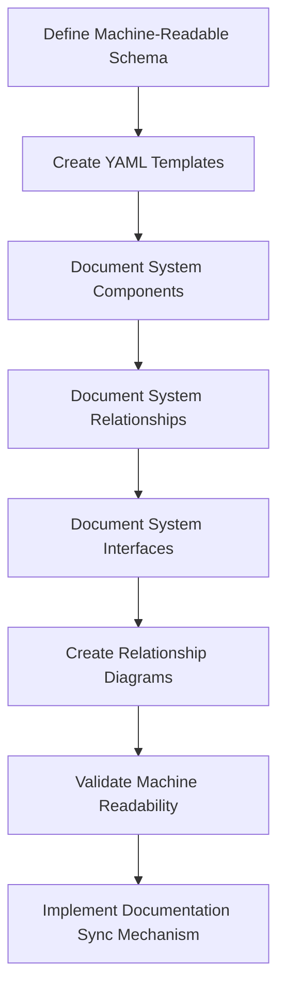
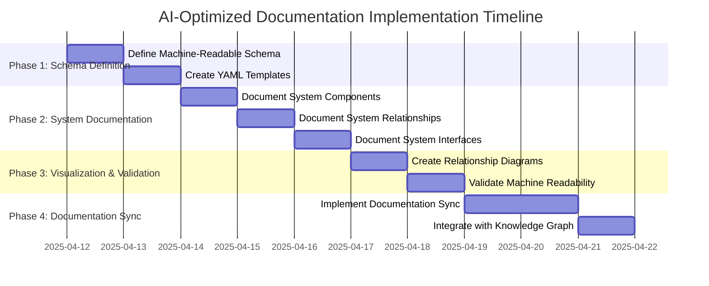

# AI-Optimized Documentation Implementation Plan

## Overview

This plan outlines the steps to implement the AI-Optimized Documentation portion of the LOCAL-LLM-Stack cleanup plan. The goal is to create a documentation structure that is optimized for AI agent comprehension, with a focus on machine-readable metadata, component relationships, and structured YAML documentation.

## Implementation Approach



## Phase 1: Machine-Readable Documentation Schema

### 1.1 Define Machine-Readable Schema

**Objective**: Create a consolidated YAML schema optimized for AI agent parsing and knowledge graph construction.

**Tasks**:
- Define a comprehensive YAML schema for the entire system documentation
- Include schemas for components, relationships, interfaces, and data flows
- Ensure the schema is machine-parsable with minimal ambiguity
- Create validation rules for the schema

**Deliverables**:
- `/docs/schema/system-schema.yaml` (consolidated schema file)

### 1.2 Create YAML Templates

**Objective**: Create a standardized YAML template for system documentation.

**Tasks**:
- Create a consolidated template for system documentation
- Include sections for components, relationships, interfaces, and data flows
- Include examples and validation rules in the template

**Deliverables**:
- `/docs/templates/system-template.yaml` (consolidated template file)

## Phase 2: System Documentation

### 2.1 Document System Components

**Objective**: Create a consolidated YAML file documenting all system components.

**Tasks**:
- Document all core components (Ollama, LibreChat, MongoDB, Meilisearch)
- Document the CLI component
- Document optional modules
- Include metadata, resource requirements, configuration parameters, volumes, and health checks for each component

**Deliverables**:
- `/docs/system/components.yaml` (consolidated components file)

### 2.2 Document System Relationships

**Objective**: Create a consolidated YAML file documenting all system relationships.

**Tasks**:
- Document component dependencies
- Document startup order dependencies
- Document runtime dependencies
- Document configuration dependencies
- Use consistent relationship types and terminology

**Deliverables**:
- `/docs/system/relationships.yaml` (consolidated relationships file)

### 2.3 Document System Interfaces

**Objective**: Create a consolidated YAML file documenting all system interfaces.

**Tasks**:
- Document all API endpoints (Ollama, LibreChat)
- Document CLI commands and parameters
- Document shell script functions and parameters
- Document inter-component communication methods
- Document data flows in the system
- Include input/output specifications for all interfaces

**Deliverables**:
- `/docs/system/interfaces.yaml` (consolidated interfaces file)

## Phase 3: Visualization and Validation

### 3.1 Create Relationship Diagrams

**Objective**: Create machine-readable diagrams of system relationships.

**Tasks**:
- Create a consolidated component relationship diagram in mermaid format
- Create a consolidated data flow diagram in mermaid format
- Ensure diagrams are machine-parsable
- Include diagram source code in documentation

**Deliverables**:
- `/docs/diagrams/system-relationships.mmd` (component relationships)
- `/docs/diagrams/system-data-flow.mmd` (data flow)

### 3.2 Validate Machine Readability

**Objective**: Ensure all documentation is optimally structured for AI agent parsing.

**Tasks**:
- Validate all YAML files against the schema
- Check for consistent terminology across all documentation
- Verify all relationships are properly documented
- Ensure all interfaces are documented
- Test parsing documentation with automated tools
- Verify knowledge graph can be constructed from documentation

**Deliverables**:
- Validation report
- Final documentation set

## Phase 4: Documentation Synchronization

### 4.1 Implement Documentation Sync Mechanism

**Objective**: Create a system to keep documentation in sync with code changes over time.

**Tasks**:
- Create a documentation extraction tool to automatically update YAML files from code
- Implement Git hooks to detect changes in relevant files
- Create a validation system to ensure documentation and code remain in sync
- Develop a documentation update workflow for developers
- Create automated tests to verify documentation accuracy

**Deliverables**:
- `/tools/doc-sync/extract-docs.sh` (documentation extraction script)
- `/tools/doc-sync/validate-docs.sh` (documentation validation script)
- `/tools/doc-sync/git-hooks/pre-commit` (Git pre-commit hook)
- `/docs/maintaining-documentation.md` (documentation maintenance guide)

#### Documentation Extraction Tool

The documentation extraction tool will:

1. Parse shell scripts to extract function definitions, parameters, and return values
2. Analyze Docker Compose files to extract component configurations
3. Examine configuration files to identify configuration options
4. Update the YAML documentation files with the extracted information
5. Flag any discrepancies between code and documentation

#### Git Hooks

Git hooks will:

1. Detect changes to shell scripts, Docker Compose files, and configuration files
2. Run the documentation extraction tool on changed files
3. Validate the updated documentation against the schema
4. Alert developers to update documentation if automatic extraction is insufficient

#### Documentation Update Workflow

The documentation update workflow will:

1. Require documentation updates as part of the code review process
2. Include documentation validation in CI/CD pipelines
3. Provide clear guidelines for maintaining documentation
4. Ensure documentation changes are reviewed alongside code changes

#### Automated Tests

Automated tests will:

1. Verify that all documented components exist in the codebase
2. Confirm that all documented interfaces match actual implementations
3. Validate that all documented relationships are accurate
4. Ensure that all documented configuration options are supported

### 4.2 Integration with Knowledge Graph Generation

**Objective**: Ensure the documentation can be used to automatically generate and update the knowledge graph.

**Tasks**:
- Create a script to generate a knowledge graph from the YAML documentation
- Implement automated knowledge graph updates when documentation changes
- Develop validation tools to ensure the knowledge graph accurately represents the system
- Create a visualization tool for the knowledge graph

**Deliverables**:
- `/tools/knowledge-graph/generate-graph.sh` (knowledge graph generation script)
- `/tools/knowledge-graph/validate-graph.sh` (knowledge graph validation script)
- `/tools/knowledge-graph/visualize-graph.sh` (knowledge graph visualization script)

## Implementation Details

### Simplified Directory Structure

```
/docs/
  ├── README.md (minimal, machine-focused)
  ├── schema/
  │   └── system-schema.yaml (consolidated schema)
  ├── templates/
  │   └── system-template.yaml (consolidated template)
  ├── system/
  │   ├── components.yaml (all components)
  │   ├── relationships.yaml (all relationships)
  │   └── interfaces.yaml (all interfaces and data flows)
  ├── diagrams/
  │   ├── system-relationships.mmd
  │   └── system-data-flow.mmd
  └── maintaining-documentation.md (guide for keeping docs in sync)

/tools/
  ├── doc-sync/
  │   ├── extract-docs.sh
  │   ├── validate-docs.sh
  │   └── git-hooks/
  │       └── pre-commit
  └── knowledge-graph/
      ├── generate-graph.sh
      ├── validate-graph.sh
      └── visualize-graph.sh
```

### Component YAML Example

```yaml
# /docs/system/components.yaml
components:
  - type: "container"
    name: "ollama"
    purpose: "Provides local LLM inference capabilities"
    image: "ollama/ollama"
    version_var: "OLLAMA_VERSION"
    default_version: "0.1.27"
    ports:
      - internal: 11434
        external_var: "HOST_PORT_OLLAMA"
        default_external: 11434
        protocol: "tcp"
        purpose: "API"
    volumes:
      - host_path: "../data/ollama"
        container_path: "/root/.ollama"
        purpose: "model_storage"
      - host_path: "../data/models"
        container_path: "/models"
        purpose: "additional_models"
    environment_variables:
      - name: "OLLAMA_HOST"
        value: "0.0.0.0"
        purpose: "Listen on all interfaces"
      - name: "OLLAMA_MODELS_PATH"
        value: "/root/.ollama/models"
        purpose: "Model storage location"
    resource_limits:
      cpu_var: "OLLAMA_CPU_LIMIT"
      cpu_default: 0.75
      memory_var: "OLLAMA_MEMORY_LIMIT"
      memory_default: "16G"
    health_check:
      command: "bash -c \"(echo > /dev/tcp/localhost/11434) 2>/dev/null || exit 1\""
      interval: "30s"
      timeout: "10s"
      retries: 3
      start_period: "40s"
  
  - type: "container"
    name: "librechat"
    purpose: "Provides web interface for interacting with LLMs"
    image: "librechat/librechat"
    version_var: "LIBRECHAT_VERSION"
    default_version: "latest"
    ports:
      - internal: 3080
        external_var: "HOST_PORT_LIBRECHAT"
        default_external: 3080
        protocol: "tcp"
        purpose: "Web UI"
    volumes:
      - host_path: "../data/librechat"
        container_path: "/app/data"
        purpose: "data_storage"
    environment_variables:
      - name: "MONGO_URI"
        value: "mongodb://mongodb:27017/librechat"
        purpose: "MongoDB connection"
      - name: "OLLAMA_HOST"
        value: "http://ollama:11434"
        purpose: "Ollama connection"
    resource_limits:
      cpu_var: "LIBRECHAT_CPU_LIMIT"
      cpu_default: 0.50
      memory_var: "LIBRECHAT_MEMORY_LIMIT"
      memory_default: "4G"
    health_check:
      command: "wget -q --spider http://localhost:3080/health || exit 1"
      interval: "30s"
      timeout: "10s"
      retries: 3
      start_period: "40s"
```

### Relationship YAML Example

```yaml
# /docs/system/relationships.yaml
relationships:
  # Component Dependencies
  - source: "librechat"
    target: "ollama"
    type: "depends_on"
    description: "LibreChat requires Ollama for LLM inference"
    interface: "http_api"
    required: true
  
  - source: "librechat"
    target: "mongodb"
    type: "depends_on"
    description: "LibreChat requires MongoDB for data storage"
    interface: "mongodb_driver"
    required: true
  
  - source: "librechat"
    target: "meilisearch"
    type: "depends_on"
    description: "LibreChat requires Meilisearch for search functionality"
    interface: "http_api"
    required: true
  
  # Startup Dependencies
  - source: "librechat"
    target: "mongodb"
    type: "startup_dependency"
    description: "LibreChat must start after MongoDB"
    condition: "mongodb_healthy"
  
  - source: "librechat"
    target: "ollama"
    type: "startup_dependency"
    description: "LibreChat must start after Ollama"
    condition: "ollama_healthy"
```

### Interface YAML Example

```yaml
# /docs/system/interfaces.yaml
# API Interfaces
api_interfaces:
  - component: "ollama"
    interface_type: "http_api"
    base_url: "http://ollama:11434"
    endpoints:
      - path: "/api/generate"
        method: "POST"
        description: "Generate text from a prompt"
        request_format:
          content_type: "application/json"
          parameters:
            - name: "model"
              type: "string"
              required: true
              description: "Name of the model to use"
            - name: "prompt"
              type: "string"
              required: true
              description: "Prompt to generate text from"
        response_format:
          content_type: "application/json"
          fields:
            - name: "response"
              type: "string"
              description: "Generated text"
      
      - path: "/api/tags"
        method: "GET"
        description: "List available models"
        response_format:
          content_type: "application/json"
          fields:
            - name: "models"
              type: "array"
              description: "List of available models"

# CLI Interfaces
cli_interfaces:
  - component: "llm_script"
    commands:
      - name: "start"
        description: "Start the LOCAL-LLM-Stack"
        function: "start_stack"
        parameters: []
      
      - name: "stop"
        description: "Stop the LOCAL-LLM-Stack"
        function: "stop_stack"
        parameters: []
```

### Documentation Sync Example

```bash
#!/bin/bash
# /tools/doc-sync/extract-docs.sh

# Extract function definitions from shell scripts
extract_shell_functions() {
  local file=$1
  local output_file="/docs/system/interfaces.yaml"
  
  # Use grep and sed to extract function definitions
  functions=$(grep -E "^function [a-zA-Z0-9_]+ *\(\)" "$file" | sed 's/function \(.*\)()/\1/')
  
  for func in $functions; do
    # Extract function description from comments
    description=$(grep -B 1 "function $func" "$file" | head -n 1 | sed 's/# //')
    
    # Extract parameters from function body
    parameters=$(grep -A 5 "function $func" "$file" | grep -E "local [a-zA-Z0-9_]+=\$[0-9]+" | sed 's/.*local \(.*\)=.*/\1/')
    
    # Update the YAML file with the extracted information
    # This is a simplified example - actual implementation would use a YAML parser
    echo "  - file: \"$file\"" >> "$output_file.tmp"
    echo "    functions:" >> "$output_file.tmp"
    echo "      - name: \"$func\"" >> "$output_file.tmp"
    echo "        description: \"$description\"" >> "$output_file.tmp"
    echo "        parameters:" >> "$output_file.tmp"
    
    for param in $parameters; do
      echo "          - name: \"$param\"" >> "$output_file.tmp"
      echo "            type: \"string\"" >> "$output_file.tmp"
      echo "            required: true" >> "$output_file.tmp"
      echo "            description: \"Parameter $param\"" >> "$output_file.tmp"
    done
  done
}

# Main function to extract documentation from all relevant files
main() {
  # Create temporary files
  > "/docs/system/interfaces.yaml.tmp"
  
  # Extract shell functions
  for file in /lib/core/*.sh; do
    extract_shell_functions "$file"
  done
  
  # Validate the extracted documentation
  if /tools/doc-sync/validate-docs.sh; then
    # Replace the old files with the new ones
    mv "/docs/system/interfaces.yaml.tmp" "/docs/system/interfaces.yaml"
    echo "Documentation updated successfully"
  else
    echo "Documentation validation failed"
    exit 1
  fi
}

main
```

## Timeline



## Success Criteria

The AI-Optimized Documentation implementation will be considered successful when:

1. All components, relationships, interfaces, and data flows are documented in consolidated YAML files
2. All documentation follows a consistent schema optimized for machine readability
3. All documentation can be validated against the defined schema
4. Machine-readable diagrams are available for system relationships and data flows
5. An autonomous AI coding agent can parse the documentation to build a comprehensive knowledge graph of the system
6. Documentation remains in sync with code changes through automated tools and processes
7. Developers can easily maintain documentation as part of their normal workflow