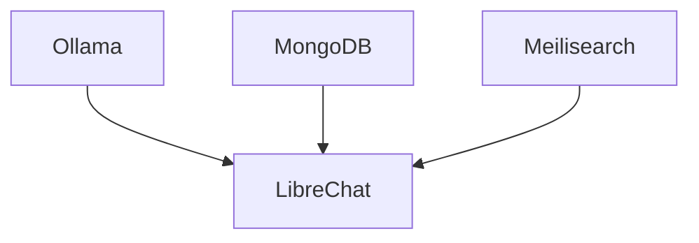

# Documentation Style Guide

## Purpose and Scope

This style guide establishes standards for all documentation in the LOCAL-LLM-Stack project. It aims to ensure consistency, clarity, and maintainability across all documentation types, whether they are machine-readable (YAML) or human-readable (Markdown).

The guide applies to:
- README files
- Markdown documentation
- YAML machine-readable documentation
- Code comments
- Diagrams and visual aids

By following these guidelines, we ensure that documentation is:
- Easy to read and understand
- Consistent in format and terminology
- Maintainable and updatable
- Accessible to both humans and AI tools

## File Organization and Naming Conventions

### Directory Structure

Documentation files should be organized according to the following structure:

```
docs/
├── README.md                     # Overview of documentation
├── *.md                          # General documentation files
├── documentation-style-guide.md  # This style guide
├── diagrams/                     # Diagram files
│   ├── *.mmd                     # Mermaid diagram source files
│   └── *.png                     # Rendered diagram images
├── schema/                       # Schema definitions
│   └── *.yaml                    # YAML schema files
├── system/                       # Machine-readable system documentation
│   ├── components.yaml           # Component documentation
│   ├── relationships.yaml        # Relationship documentation
│   └── interfaces.yaml           # Interface documentation
└── templates/                    # Documentation templates
    ├── *.md                      # Markdown templates
    └── *.yaml                    # YAML templates
```

### File Naming

- Use lowercase for all filenames
- Use hyphens (`-`) to separate words in filenames
- Use descriptive names that indicate the file's content
- Use appropriate file extensions (`.md` for Markdown, `.yaml` for YAML, `.mmd` for Mermaid)

Examples:
```
getting-started.md
system-schema.yaml
component-relationships.mmd
```

## Formatting Standards

### Markdown Formatting

#### Headers

- Use ATX-style headers with a space after the hash marks
- Use title case for headers
- Use a single level-1 header (`#`) at the top of the document as the title
- Use appropriate header levels to create a logical hierarchy
- Do not skip header levels (e.g., don't go from `##` to `####`)

Example:
```markdown
# Document Title

## Section Heading

### Subsection Heading
```

#### Lists

- Use hyphens (`-`) for unordered lists
- Use numbers followed by periods (`1.`) for ordered lists
- Use consistent indentation (2 spaces) for nested lists
- Add a blank line before and after lists

Example:
```markdown
The system includes the following components:

- Ollama
- LibreChat
- MongoDB
- Meilisearch

The installation process involves:

1. Clone the repository
2. Configure the environment
3. Start the services
```

#### Code Blocks

- Use triple backticks (```) for code blocks
- Specify the language for syntax highlighting
- Use inline code with single backticks (`) for short code references

Example:
```markdown
Install the package with:

```bash
npm install package-name
```

Use the `start()` function to initialize the service.
```

#### Links

- Use descriptive link text
- Use relative links for internal documentation
- Use absolute links for external resources

Example:
```markdown
See the [installation guide](installation.md) for setup instructions.

Visit [MINT-RESEARCH](https://mint-research.com) for more information.
```

#### Tables

- Use tables for structured data
- Include a header row
- Align columns consistently
- Use a minimum of three hyphens per column in the separator row

Example:
```markdown
| Component | Purpose | Port |
|-----------|---------|------|
| Ollama    | LLM inference | 11434 |
| LibreChat | Web interface | 3080 |
| MongoDB   | Database | 27017 |
```

### YAML Formatting

- Use 2 spaces for indentation
- Use lowercase for keys
- Use underscores (`_`) to separate words in keys
- Include comments to explain complex structures
- Keep lines to a reasonable length (80-100 characters)
- Use consistent formatting for similar structures

Example:
```yaml
# Component definition
components:
  - type: "container"
    name: "ollama"
    purpose: "Provides local LLM inference capabilities"
    image: "ollama/ollama"
    version_var: "OLLAMA_VERSION"
    default_version: "0.1.27"
    # Additional properties...
```

## Writing Style and Tone

### General Guidelines

- Write in clear, concise language
- Use active voice rather than passive voice
- Be direct and straightforward
- Maintain a professional, technical tone
- Avoid jargon unless it's standard terminology in the field
- Define acronyms and technical terms on first use

### Audience Considerations

- Assume the reader has basic technical knowledge but may not be familiar with the specific system
- Provide context and background information where necessary
- Include examples to illustrate complex concepts
- Consider both human readers and AI tools that may process the documentation

### Grammar and Punctuation

- Use consistent verb tense (present tense is preferred)
- Use the Oxford comma in lists
- Use sentence case for bullet points and list items
- End complete sentences with periods, even in lists
- Avoid exclamation marks in technical documentation

## Terminology Standards

### Standard Terms

Use consistent terminology throughout all documentation. The following terms should be used consistently:

| Term | Definition | Usage |
|------|------------|-------|
| LOCAL-LLM-Stack | The complete system for running LLMs locally | Always use uppercase for "LOCAL-LLM-Stack" |
| Ollama | The local LLM inference server | Always capitalize "Ollama" |
| LibreChat | The web interface for interacting with LLMs | Always use camelCase for "LibreChat" |
| component | A discrete part of the system | Use for containers, services, or modules |
| relationship | A connection between components | Use for dependencies or interactions |
| interface | A method of interaction between components | Use for APIs, CLIs, or other interaction points |

### Abbreviations and Acronyms

- Define abbreviations and acronyms on first use
- Use consistent capitalization for acronyms (typically all caps)
- Include common abbreviations in the glossary

Example:
```markdown
The Large Language Model (LLM) provides natural language processing capabilities. LLMs can be used for various tasks.
```

## Examples and Templates Usage

### Code Examples

- Provide clear, concise examples that demonstrate the concept
- Include comments to explain key parts of the code
- Use realistic variable and function names
- Show both input and expected output where applicable

Example:
```markdown
To start the stack, use the following command:

```bash
./llm start
```

This will start all containers and display the status:

```
Starting LOCAL-LLM-Stack...
[✓] Ollama: Running
[✓] LibreChat: Running
[✓] MongoDB: Running
[✓] Meilisearch: Running
```
```

### Command Examples

- Use a consistent format for command examples
- Include the command prompt symbol (`$` for regular user, `#` for root)
- Show example output where helpful
- Explain command options and arguments

Example:
```markdown
$ ./llm status
Checking LOCAL-LLM-Stack status...
[✓] Ollama: Running
[✓] LibreChat: Running
[✓] MongoDB: Running
[✓] Meilisearch: Running
```

### Using Templates

- Use the provided templates for creating new documentation
- Follow the structure and formatting in the templates
- Include all required sections
- Customize optional sections as needed

## Visual Aids Guidelines

### Diagram Types

- **Component Diagrams**: Show the structure and relationships of system components
- **Data Flow Diagrams**: Illustrate how data moves through the system
- **Sequence Diagrams**: Demonstrate the order of operations or interactions
- **Architecture Diagrams**: Provide a high-level view of the system architecture

### Mermaid Syntax

- Use Mermaid for creating diagrams
- Follow the Mermaid syntax guidelines
- Keep diagrams simple and focused
- Include a title for each diagram
- Use consistent node and edge styles

Example:
```markdown

```

### Diagram Placement

- Include diagrams directly in Markdown files using Mermaid syntax
- Store diagram source code in the `docs/diagrams/` directory
- Reference diagrams in relevant documentation
- Provide text descriptions of diagrams for accessibility

## Machine-Readable Documentation Requirements

### YAML Structure

- Follow the schema defined in `docs/schema/system-schema.yaml`
- Include all required fields
- Use consistent formatting and indentation
- Add comments to explain complex structures
- Validate YAML files against the schema

### Required Fields

Each type of machine-readable documentation has specific required fields:

#### Components
- `type`: The type of component (container, script, library, module)
- `name`: The name of the component
- `purpose`: A brief description of the component's purpose

#### Relationships
- `source`: The source component
- `target`: The target component
- `type`: The type of relationship
- `description`: A description of the relationship

#### Interfaces
- `component`: The component providing the interface
- `interface_type`: The type of interface
- `base_url`: The base URL for API interfaces
- `endpoints`: The endpoints for API interfaces

### Validation

- Validate all machine-readable documentation against the schema
- Use the validation tool (`tools/doc-sync/validate-docs.sh`)
- Fix any validation errors before committing changes
- Ensure cross-references between documents are valid

## Documentation Maintenance Procedures

### Updating Documentation

- Update documentation when code changes
- Use the documentation extraction tools to keep documentation in sync
- Validate documentation after updates
- Review documentation changes as part of code reviews

### Documentation Review Process

- Include documentation review in the code review process
- Check for adherence to this style guide
- Verify accuracy and completeness
- Ensure consistency with other documentation

### Using Git Hooks

- Install the provided Git hooks to automate documentation validation
- Address any issues reported by the hooks before committing
- Use the extraction tools to update documentation automatically

### Reporting Documentation Issues

- Report documentation issues using the issue tracker
- Include specific details about the issue
- Suggest improvements or corrections
- Reference related code or documentation

## Glossary

| Term | Definition |
|------|------------|
| API | Application Programming Interface |
| CLI | Command Line Interface |
| LLM | Large Language Model |
| YAML | YAML Ain't Markup Language, a human-readable data serialization format |
| Mermaid | A JavaScript-based diagramming and charting tool |
| Markdown | A lightweight markup language for creating formatted text |
| Git hook | A script that runs automatically when a specific Git event occurs |